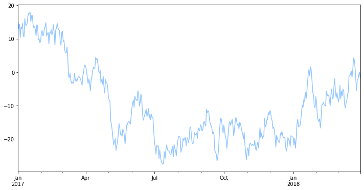
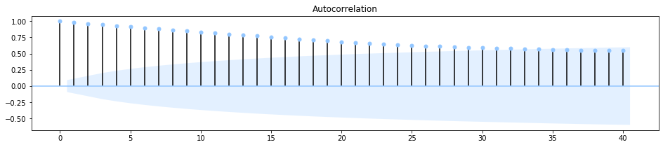
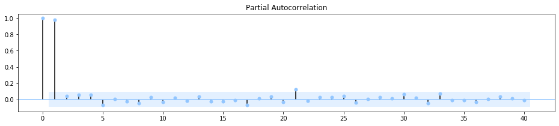
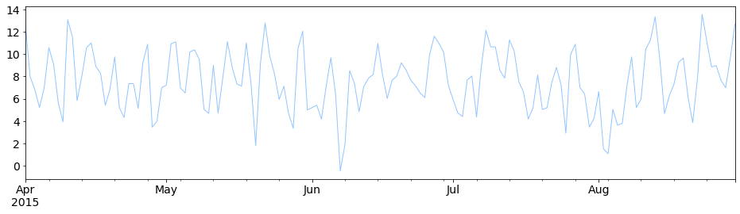
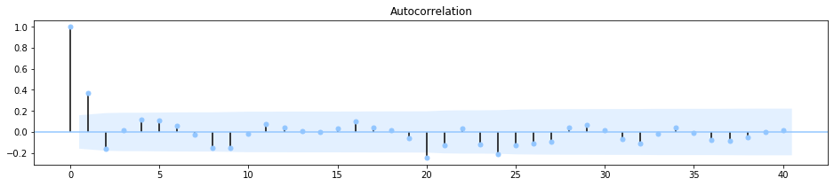
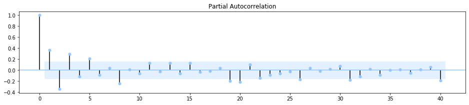
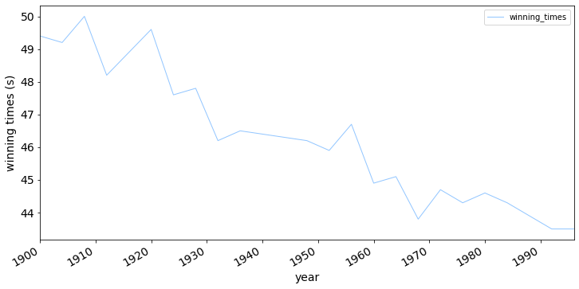
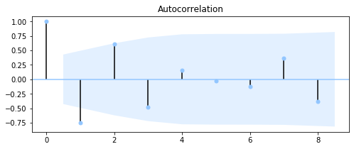
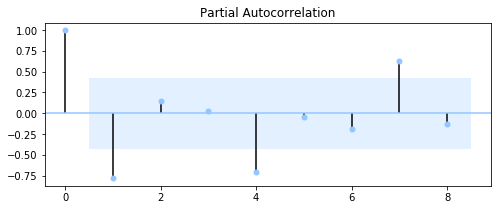

# ARMA Models - Lab

## Introduction

In this lab, you'll practice your knowledge the Autoregressive (AR), the Moving Average (MA) model, and the combined ARMA model.

## Objectives

You will be able to:
- Understand and explain what a Autoregressive model is
- Understand and explain what a Moving Average model is
- Understand and apply the mathematical formulations for Autoregressive and Moving Average models
- Understand how AR and MA can be combined in ARMA models

## Generate an AR model of the first order with $\phi = 0.7$


```python
#import the necessary libraries
import pandas as pd
import numpy as np 
import matplotlib.pyplot as plt
import statsmodels.api as sm
plt.style.use('seaborn-pastel')
import warnings
warnings.filterwarnings('ignore')

```

Recall that the AR model has the following formula:

$$Y_t = \mu + \phi * Y_{t-1}+\epsilon_t$$

This means that:

$$Y_1 = \mu + \phi * Y_{0}+\epsilon_1$$
$$Y_2 = \mu + \phi * (\text{mean-centered version of } Y_1) +\epsilon_2$$

and so on. 

Assume a mean-zero white noise with a standard deviation of 2. Make sure you have a daily datetime index ranging from January 2017 until the end of March 2018. Assume that $\mu=5$ and $Y_0= 8$.


```python
# keep the random seed
np.random.seed(11225)

# create a series with the specified dates
date = pd.date_range(start='1-01-2017', end='3-31-2018', freq='D')
len(date)
```


    455


```python
# store the parameters
mu = 5
y_0 = 8
phi = 0.7

error = np.random.normal(loc=0, scale=2, size=455)
```


```python
# generate the time series according to the formula

data = [None] * 455
y = y_0
for i, row in enumerate(date):
    data[i] = mu + y + error[i]
    y = data[i] - mu

#
```

Plot the time series and verify what you see


```python
ts = pd.Series(data=data, index=date)

ts.plot(figsize=(12,6))
```


    <matplotlib.axes._subplots.AxesSubplot at 0x1c1a25aeb8>





## Look at the ACF and PACF of your model and write down your conclusions

We recommend to use `plot_acf` in statsmodels instead of the pandas ACF variant.


```python
from statsmodels.graphics.tsaplots import plot_pacf
from statsmodels.graphics.tsaplots import plot_acf

fig, ax = plt.subplots(figsize=(16,3))
plot_acf(ts, ax=ax, lags=40);

fig, ax = plt.subplots(figsize=(16,3))
plot_pacf(ts, ax=ax, lags=40);
```








## Check your model with ARMA in statsmodels

Statsmodels also has a tool that fits ARMA models on time series. The only thing you have to do is provide the number of orders for AR vs MA. Have a look at the code below, and the output of the code. Make sure that the output for the $\phi$ parameter and $\mu$ is as you'd expect!


```python
# assuming your time series are stored in an object "series"
# Import the ARMA module from statsmodels
from statsmodels.tsa.arima_model import ARMA
import statsmodels.api as sm

# Fit an MA(1) model to the first simulated data
mod_arma = ARMA(ts, order=(1,0))
res_arma = mod_arma.fit()

# Print out summary information on the fit
print(res_arma.summary())

# Print out the estimate for the constant and for theta
print(res_arma.params)
```

                                  ARMA Model Results                              
    ==============================================================================
    Dep. Variable:                      y   No. Observations:                  455
    Model:                     ARMA(1, 0)   Log Likelihood                -966.474
    Method:                       css-mle   S.D. of innovations              2.016
    Date:                Thu, 09 Jan 2020   AIC                           1938.948
    Time:                        19:09:31   BIC                           1951.309
    Sample:                    01-01-2017   HQIC                          1943.817
                             - 03-31-2018                                         
    ==============================================================================
                     coef    std err          z      P>|z|      [0.025      0.975]
    ------------------------------------------------------------------------------
    const         -5.3411      6.853     -0.779      0.436     -18.772       8.090
    ar.L1.y        0.9877      0.007    136.395      0.000       0.973       1.002
                                        Roots                                    
    =============================================================================
                      Real          Imaginary           Modulus         Frequency
    -----------------------------------------------------------------------------
    AR.1            1.0125           +0.0000j            1.0125            0.0000
    -----------------------------------------------------------------------------
    const     -5.341079
    ar.L1.y    0.987664
    dtype: float64


## Generate an MA model of the first order with $\theta = 0.9$

Recall that the MA model has the following formula:

$$Y_t = \mu +\epsilon_t + \theta * \epsilon_{t-1}$$

This means that:

$$Y_1 = \mu + \epsilon_1+  \theta * \epsilon_{0}$$
$$Y_2 = \mu + \epsilon_2+  \theta * \epsilon_{1}$$

and so on. 

Assume a mean-zero white noise with a standard deviation of 4. Make sure you have a daily datetime index is ranging from April 2015 until the end of August 2015. Assume that $\mu=7$.


```python
# keep the random seed
np.random.seed(1234)

# create a series with the specified dates
date = pd.date_range(start='4-01-2015', end='8-30-2015', freq='D')

# store the parameters
mu = 7
theta = 0.9

#generate the time series
TS = [None] * len(date)
prev_err = error[0]
for i, row in enumerate(date):
    TS[i] = mu + theta + prev_err + error[i]
    prev_err = error[i]
```


```python
# Plot the time series
ts = pd.Series(data=TS, index=date)
ts.plot(figsize=(16,4), linewidth=1, fontsize=14)
```


    <matplotlib.axes._subplots.AxesSubplot at 0x1c1b2e2e80>





## Look at the ACF and PACF of your model and write down your conclusions


```python
# from statsmodels.graphics.tsaplots import plot_pacf
# from statsmodels.graphics.tsaplots import plot_acf

fig, ax = plt.subplots(figsize=(16,3))
plot_acf(ts, ax=ax, lags=40);

fig, ax = plt.subplots(figsize=(16,3))
plot_pacf(ts, ax=ax, lags=40);
```








## Check your model with ARMA in statsmodels

Repeat what you did for your AR model but now for your MA model to verify the parameters are estimated correctly.


```python
# Fit an AR(1) model to the first simulated data

# Import the ARMA module from statsmodels
from statsmodels.tsa.arima_model import ARMA
import statsmodels.api as sm

# Fit an MA(1) model to the first simulated data
mod_arma = ARMA(ts, order=(0,1))
res_arma = mod_arma.fit()

# Print out summary information on the fit
print(res_arma.summary())

# print(res_arma.params)


```

                                  ARMA Model Results                              
    ==============================================================================
    Dep. Variable:                      y   No. Observations:                  152
    Model:                     ARMA(0, 1)   Log Likelihood                -326.055
    Method:                       css-mle   S.D. of innovations              2.038
    Date:                Thu, 09 Jan 2020   AIC                            658.109
    Time:                        19:20:57   BIC                            667.181
    Sample:                    04-01-2015   HQIC                           661.795
                             - 08-30-2015                                         
    ==============================================================================
                     coef    std err          z      P>|z|      [0.025      0.975]
    ------------------------------------------------------------------------------
    const          7.6216      0.329     23.191      0.000       6.977       8.266
    ma.L1.y        0.9948      0.048     20.717      0.000       0.901       1.089
                                        Roots                                    
    =============================================================================
                      Real          Imaginary           Modulus         Frequency
    -----------------------------------------------------------------------------
    MA.1           -1.0052           +0.0000j            1.0052            0.5000
    -----------------------------------------------------------------------------


## Create a model for the 400m data set

Import the data set containing the historical running times for the men's 400m on the Olympic games.


```python
# the data is in "winning_400m.csv"
data = pd.read_csv('winning_400m.csv')
# data.year = data.year.astype(str)
data.year = pd.to_datetime(data.year.astype(str))
data.info()
```

    <class 'pandas.core.frame.DataFrame'>
    RangeIndex: 22 entries, 0 to 21
    Data columns (total 2 columns):
    year             22 non-null datetime64[ns]
    winning_times    22 non-null float64
    dtypes: datetime64[ns](1), float64(1)
    memory usage: 480.0 bytes


```python
data.head()
```


<div>
<style scoped>
    .dataframe tbody tr th:only-of-type {
        vertical-align: middle;
    }

    .dataframe tbody tr th {
        vertical-align: top;
    }

    .dataframe thead th {
        text-align: right;
    }
</style>
<table border="1" class="dataframe">
  <thead>
    <tr style="text-align: right;">
      <th></th>
      <th>year</th>
      <th>winning_times</th>
    </tr>
  </thead>
  <tbody>
    <tr>
      <td>0</td>
      <td>1900-01-01</td>
      <td>49.4</td>
    </tr>
    <tr>
      <td>1</td>
      <td>1904-01-01</td>
      <td>49.2</td>
    </tr>
    <tr>
      <td>2</td>
      <td>1908-01-01</td>
      <td>50.0</td>
    </tr>
    <tr>
      <td>3</td>
      <td>1912-01-01</td>
      <td>48.2</td>
    </tr>
    <tr>
      <td>4</td>
      <td>1920-01-01</td>
      <td>49.6</td>
    </tr>
  </tbody>
</table>
</div>


```python
data.set_index('year', inplace=True)
data.head()
```


<div>
<style scoped>
    .dataframe tbody tr th:only-of-type {
        vertical-align: middle;
    }

    .dataframe tbody tr th {
        vertical-align: top;
    }

    .dataframe thead th {
        text-align: right;
    }
</style>
<table border="1" class="dataframe">
  <thead>
    <tr style="text-align: right;">
      <th></th>
      <th>winning_times</th>
    </tr>
    <tr>
      <th>year</th>
      <th></th>
    </tr>
  </thead>
  <tbody>
    <tr>
      <td>1900-01-01</td>
      <td>49.4</td>
    </tr>
    <tr>
      <td>1904-01-01</td>
      <td>49.2</td>
    </tr>
    <tr>
      <td>1908-01-01</td>
      <td>50.0</td>
    </tr>
    <tr>
      <td>1912-01-01</td>
      <td>48.2</td>
    </tr>
    <tr>
      <td>1920-01-01</td>
      <td>49.6</td>
    </tr>
  </tbody>
</table>
</div>


Plot the data


```python
data.plot(figsize=(12,6), linewidth=1, fontsize=14)
plt.xlabel('year', fontsize=14)
plt.ylabel('winning times (s)', fontsize=14);
```





Difference the data to get a stationary time series. Make sure to remove the first NaN value.


```python
data_diff = data.diff().dropna()
data_diff
```


<div>
<style scoped>
    .dataframe tbody tr th:only-of-type {
        vertical-align: middle;
    }

    .dataframe tbody tr th {
        vertical-align: top;
    }

    .dataframe thead th {
        text-align: right;
    }
</style>
<table border="1" class="dataframe">
  <thead>
    <tr style="text-align: right;">
      <th></th>
      <th>winning_times</th>
    </tr>
    <tr>
      <th>year</th>
      <th></th>
    </tr>
  </thead>
  <tbody>
    <tr>
      <td>1904-01-01</td>
      <td>-0.2</td>
    </tr>
    <tr>
      <td>1908-01-01</td>
      <td>0.8</td>
    </tr>
    <tr>
      <td>1912-01-01</td>
      <td>-1.8</td>
    </tr>
    <tr>
      <td>1920-01-01</td>
      <td>1.4</td>
    </tr>
    <tr>
      <td>1924-01-01</td>
      <td>-2.0</td>
    </tr>
    <tr>
      <td>1928-01-01</td>
      <td>0.2</td>
    </tr>
    <tr>
      <td>1932-01-01</td>
      <td>-1.6</td>
    </tr>
    <tr>
      <td>1936-01-01</td>
      <td>0.3</td>
    </tr>
    <tr>
      <td>1948-01-01</td>
      <td>-0.3</td>
    </tr>
    <tr>
      <td>1952-01-01</td>
      <td>-0.3</td>
    </tr>
    <tr>
      <td>1956-01-01</td>
      <td>0.8</td>
    </tr>
    <tr>
      <td>1960-01-01</td>
      <td>-1.8</td>
    </tr>
    <tr>
      <td>1964-01-01</td>
      <td>0.2</td>
    </tr>
    <tr>
      <td>1968-01-01</td>
      <td>-1.3</td>
    </tr>
    <tr>
      <td>1972-01-01</td>
      <td>0.9</td>
    </tr>
    <tr>
      <td>1976-01-01</td>
      <td>-0.4</td>
    </tr>
    <tr>
      <td>1980-01-01</td>
      <td>0.3</td>
    </tr>
    <tr>
      <td>1984-01-01</td>
      <td>-0.3</td>
    </tr>
    <tr>
      <td>1988-01-01</td>
      <td>-0.4</td>
    </tr>
    <tr>
      <td>1992-01-01</td>
      <td>-0.4</td>
    </tr>
    <tr>
      <td>1996-01-01</td>
      <td>0.0</td>
    </tr>
  </tbody>
</table>
</div>


```python
# Look at ACF and PACF
# from statsmodels.graphics.tsaplots import plot_pacf
# from statsmodels.graphics.tsaplots import plot_acf

fig, ax = plt.subplots(figsize=(8,3))
plot_acf(data_diff, ax=ax, lags=8);

fig, ax = plt.subplots(figsize=(8,3))
plot_pacf(data_diff, ax=ax, lags=8);
```








Based on the ACF and PACF, fit an arma model with the right orders for AR and MA. Feel free to try different models and compare AIC and BIC values, as well as significance values for the parameter estimates.


```python
# Import the ARMA module from statsmodels
# from statsmodels.tsa.arima_model import ARMA
# import statsmodels.api as sm

# Fit an MA(1) model to the first simulated data
mod_arma = ARMA(data_diff, order=(2,1))
res_arma = mod_arma.fit()

# Print out summary information on the fit
print(res_arma.summary())

# Print out the estimate for the constant and for theta
print(res_arma.params)
```

                                  ARMA Model Results                              
    ==============================================================================
    Dep. Variable:          winning_times   No. Observations:                   21
    Model:                     ARMA(2, 1)   Log Likelihood                 -18.955
    Method:                       css-mle   S.D. of innovations              0.562
    Date:                Thu, 09 Jan 2020   AIC                             47.911
    Time:                        19:32:26   BIC                             53.133
    Sample:                             0   HQIC                            49.044
                                                                                  
    =======================================================================================
                              coef    std err          z      P>|z|      [0.025      0.975]
    ---------------------------------------------------------------------------------------
    const                  -0.2916      0.073     -4.018      0.001      -0.434      -0.149
    ar.L1.winning_times    -1.6827      0.119    -14.199      0.000      -1.915      -1.450
    ar.L2.winning_times    -0.7714      0.128     -6.022      0.000      -1.022      -0.520
    ma.L1.winning_times     0.9999      0.132      7.550      0.000       0.740       1.259
                                        Roots                                    
    =============================================================================
                      Real          Imaginary           Modulus         Frequency
    -----------------------------------------------------------------------------
    AR.1           -1.0907           -0.3268j            1.1386           -0.4537
    AR.2           -1.0907           +0.3268j            1.1386            0.4537
    MA.1           -1.0001           +0.0000j            1.0001            0.5000
    -----------------------------------------------------------------------------
    const                 -0.291557
    ar.L1.winning_times   -1.682691
    ar.L2.winning_times   -0.771402
    ma.L1.winning_times    0.999875
    dtype: float64


```python
# Try another one
# Fit an MA(1) model to the first simulated data
mod_arma = ARMA(data_diff, order=(2,2))
res_arma = mod_arma.fit()

# Print out summary information on the fit
print(res_arma.summary())

# Print out the estimate for the constant and for theta
print(res_arma.params)
```

                                  ARMA Model Results                              
    ==============================================================================
    Dep. Variable:          winning_times   No. Observations:                   21
    Model:                     ARMA(2, 2)   Log Likelihood                 -16.472
    Method:                       css-mle   S.D. of innovations              0.461
    Date:                Thu, 09 Jan 2020   AIC                             44.943
    Time:                        19:32:52   BIC                             51.210
    Sample:                             0   HQIC                            46.303
                                                                                  
    =======================================================================================
                              coef    std err          z      P>|z|      [0.025      0.975]
    ---------------------------------------------------------------------------------------
    const                  -0.2718      0.098     -2.779      0.013      -0.463      -0.080
    ar.L1.winning_times    -1.7575      0.097    -18.070      0.000      -1.948      -1.567
    ar.L2.winning_times    -0.9182      0.092    -10.002      0.000      -1.098      -0.738
    ma.L1.winning_times     1.5682      0.221      7.083      0.000       1.134       2.002
    ma.L2.winning_times     1.0000      0.253      3.951      0.001       0.504       1.496
                                        Roots                                    
    =============================================================================
                      Real          Imaginary           Modulus         Frequency
    -----------------------------------------------------------------------------
    AR.1           -0.9571           -0.4161j            1.0436           -0.4347
    AR.2           -0.9571           +0.4161j            1.0436            0.4347
    MA.1           -0.7841           -0.6206j            1.0000           -0.3934
    MA.2           -0.7841           +0.6206j            1.0000            0.3934
    -----------------------------------------------------------------------------
    const                 -0.271803
    ar.L1.winning_times   -1.757476
    ar.L2.winning_times   -0.918152
    ma.L1.winning_times    1.568181
    ma.L2.winning_times    1.000000
    dtype: float64


```python
# Fit an MA(1) model to the first simulated data
mod_arma = ARMA(data_diff, order=(1,1))
res_arma = mod_arma.fit()

# Print out summary information on the fit
print(res_arma.summary())

# Print out the estimate for the constant and for theta
print(res_arma.params)
```

                                  ARMA Model Results                              
    ==============================================================================
    Dep. Variable:          winning_times   No. Observations:                   21
    Model:                     ARMA(1, 1)   Log Likelihood                 -19.958
    Method:                       css-mle   S.D. of innovations              0.615
    Date:                Thu, 09 Jan 2020   AIC                             47.916
    Time:                        19:33:26   BIC                             52.094
    Sample:                             0   HQIC                            48.822
                                                                                  
    =======================================================================================
                              coef    std err          z      P>|z|      [0.025      0.975]
    ---------------------------------------------------------------------------------------
    const                  -0.2850      0.086     -3.298      0.004      -0.454      -0.116
    ar.L1.winning_times    -0.7708      0.160     -4.826      0.000      -1.084      -0.458
    ma.L1.winning_times     0.1172      0.254      0.462      0.650      -0.380       0.614
                                        Roots                                    
    =============================================================================
                      Real          Imaginary           Modulus         Frequency
    -----------------------------------------------------------------------------
    AR.1           -1.2974           +0.0000j            1.2974            0.5000
    MA.1           -8.5305           +0.0000j            8.5305            0.5000
    -----------------------------------------------------------------------------
    const                 -0.285012
    ar.L1.winning_times   -0.770752
    ma.L1.winning_times    0.117226
    dtype: float64


## What is your final model? Why did you pick this model?


```python
# Your comments here
```

## Summary

Great! Now that you know the ins and outs of ARMA models and you've practiced your modeling knowledge.
